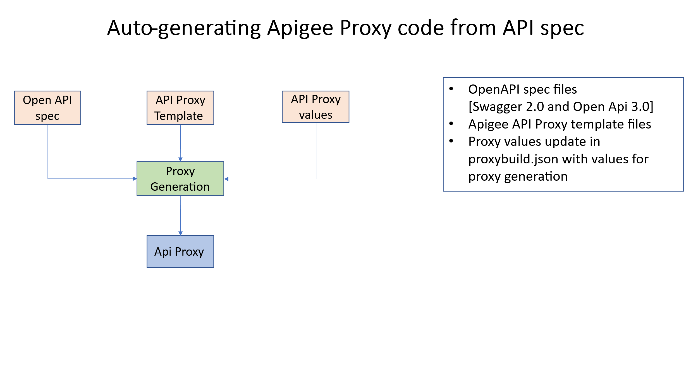

## Apigee API Proxy Generation based on Templates

- [To install](#to-install)
- [Prerequisite & Versions](#prerequisite-versions)

### Project Structure
- [Paths](#paths)
- [Input files](#input-files)
  - [proxytobuild.json](#proxytobuild.json)
  - [Template Files](#template-files)
  - [Specs folder](#specs-folder)

### Execution
- [To run in WSL](#to-run-in-wsl)

In the general case, API Proxies code deployed on the API Platform support the
non-functional requirements of APIs. These include security , routing,
logging,auditing etc . The API proxy code is repetitive and pattern-based,
making it ideal for templating.

This tool generates proxy code using the following inputs:  
(1) an OpenAPI specification,  
(2) a proxy template, and  
(3) an input JSON message containing values for template variable substitution
and other metadata such as the proxy name.

ApigeeProxyGeneration.md

### To install

Clone repo to your desktop

<https://github.com/mhashir69/oas-apiproxy-gen/tree/main>

You will always run commands from the \\oas-apiproxy-gen\\src\\specToProxy
folder.

1.  ./proxytobuild.sh

2.  node main.js

3.  Input files , openApi spec, templates in template folder and value to use to
    build proxy (more detailed explanation further down in the document)

    1.  oas-apiproxy-gen\\src\\specs\\**petstore.yaml**

    2.  oas-apiproxy-gen\\src\\specToProxy\\templates\\**Template-V3-fh-sec-rt-eh-lg**

    3.  oas-apiproxy-gen\\src\\specToProxy\\resources\\**proxytobuild.json**

### Prerequisite & Versions

This code is tested on a Windows Subsystem for Linux.

\$ **lsb_release -a**

>   No LSB modules are available.

>   Distributor ID: Ubuntu

>   Description: Ubuntu 22.04.5 LTS

>   Release: 22.04

>   Codename: jammy

\$ **node –version**

>   v20.20.2

**npm list** \@apidevtools/swagger-parser handlebars lodash --depth=0

>   oas-apiproxy-gen\@1.0.0

>   ├── \@apidevtools/swagger-parser\@12.1.0

>   ├── handlebars\@4.7.9

>   └── <lodash@4.18.1>

Use npm install or upgrade to install the lhese version or the latest ones

\$ **jq --version**

>   jq-1.6

>   Note: install jq on WSL

>   sudo apt install jq

### Paths

src

├── gateway **contains generated proxy code**

├── sharedflows

├── specs **contains openAPI specs**

├── specToProxy

│ ├── hbs

│ ├── node_modules

│ ├── resources **contains file proxytobuild.json**

│ ├── templates **contains proxy templates**

│ └── utils

### Input files

#### Proxytobuild.json

Json messages, each json message is formatted and stored as a single line. For
each proxy to build there will be a single line in the file.

See explainer

{

"proxyname": "Gen-httpbin", **Name of proxy to build and is written to the
Gateway folder show in the structure above**

"templatename": "Template-V3-fh-sec-rt-eh-lg", **Template to use and is read
from the templates folder**

"basepath": "gen-httpbin",

"urltarget": "https://httpbin.org", **variable urltarget in the template files
will be replaced with this value and the generated proxy is stored in the
gateway folder**

"openapispecfile": "httpbin.yaml" **openApi spec file is read from the specs
folder**

}

#### Template Files

The folder structure the proxy template files are stored in

── templates

│ │ └── Template-V3-fh-sec-rt-eh-lg

│ │ └── apiproxy

│ │ ├── manifests

│ │ ├── policies

│ │ ├── proxies

│ │ └── targets

Looking into the files ,

**\\specToProxy\\templates\\Template-V3-fh-sec-rt-eh\\pom.xml**

>   \<project xmlns="http://maven.apache.org/POM/4.0.0" xmlns:xsi="http://www.w3.org/2001/XMLSchema-instance" xsi:schemaLocation="http://maven.apache.org/POM/4.0.0
>   http://maven.apache.org/xsd/maven-4.0.0.xsd"\>

>   \<parent\>\<artifactId\>parent-pom\</artifactId\>

>   \<groupId\>apigee\</groupId\>

>   \<version\>1.0\</version\>

>   \<relativePath\>../shared-pom.xml\</relativePath\>

>   \</parent\>

>   \<modelVersion\>4.0.0\</modelVersion\>

>   \<groupId\>apigee\</groupId\>

**\<artifactId\>{{proxyname}}\</artifactId\> variable, also called handlebar
variable which will be replaced with values from Proxytobuild.json file**

>   \<version\>1.0\</version\>

**\<name\>{{proxyname}}\</name\>**

>   \<packaging\>pom\</packaging\>

>   \</project\>

Another file

**\\apiproxy\\proxies\\default.xml**

OK , here we see some more of this handlebar templating code – its minimal

There is the basic variable substitution , and then there is an if condition
check , and a “for loop” to handle multiple paths(routes) . Yes, you have to
learn a few handlebar commands to build your template.

https://handlebarsjs.com/

>   \<ProxyEndpoint name="default"\>

>   \<DefaultFaultRule name="default-fault"\>

>   \<Step\>

>   \<Name\>FC_ErrorHandling\</Name\>

>   \</Step\>

>   \<Step\>

>   \<Name\>FC_Logging\</Name\>

>   \</Step\>

>   \<AlwaysEnforce\>true\</AlwaysEnforce\>

>   \</DefaultFaultRule\>

>   \<PreFlow name="PreFlow"\>

>   \<Request/\>

>   \<Response/\>

>   \</PreFlow\>

\<Flows\>

{{\#if paths}} {{\#each paths}} // for each uri path

\<Flow name="{{keyHttpverb}} {{keyPath}}"\>

\<Description\>{{description}}\</Description\>

\<Request/\>

\<Response/\>

\<Condition\>(proxy.pathsuffix MatchesPath "{{keyPath}}") and (request.verb =
"{{loud keyHttpverb}}" )\</Condition\>

\</Flow\>

{{/each}} {{/if}} // for each uri path

\</Flows\>

>   \<PostFlow name="PostFlow"\>

>   \<Request/\>

>   \<Response/\>

>   \</PostFlow\>

\<HTTPProxyConnection\>

\<BasePath\>/{{basepath}}\</BasePath\>

\<VirtualHost\>secure\</VirtualHost\>

\</HTTPProxyConnection\>

\<RouteRule name="default"\>

\<TargetEndpoint\>default\</TargetEndpoint\>

\</RouteRule\>

\</ProxyEndpoint\>

#### specs folder

Is just that, Openapi files either swagger 2.0 or swagger 3.x

### To run in WSL

Change to directory **specToProxy**

**src/specToProxy\$ ./proxybuild.sh**

>   Start: /mnt/c/Users/mhash/Documents/apigeeWS/apigeeWS/src/specToProxy

>   ProxyName: petStore \| TemplateName: Template-V3-fh-sec-rt-eh

>   ProxyName: Gen-httpbin \| TemplateName: Template-V3-fh-sec-rt-eh

**src/specToProxy\$ node main.js**

>   Using Swagger Parser Version: Latest/ESM

>   Starting Proxy Build Process...

>   Building proxy: petStore

>   Template Name: Template-V3-fh-sec-rt-eh

>   Processing directory: ../../src/gateway/petStore

>   API name: Swagger Petstore - OpenAPI 3.1, Version: 1.0.12

>   Successfully updated 5 files.

>   Finished proxy: petStore
