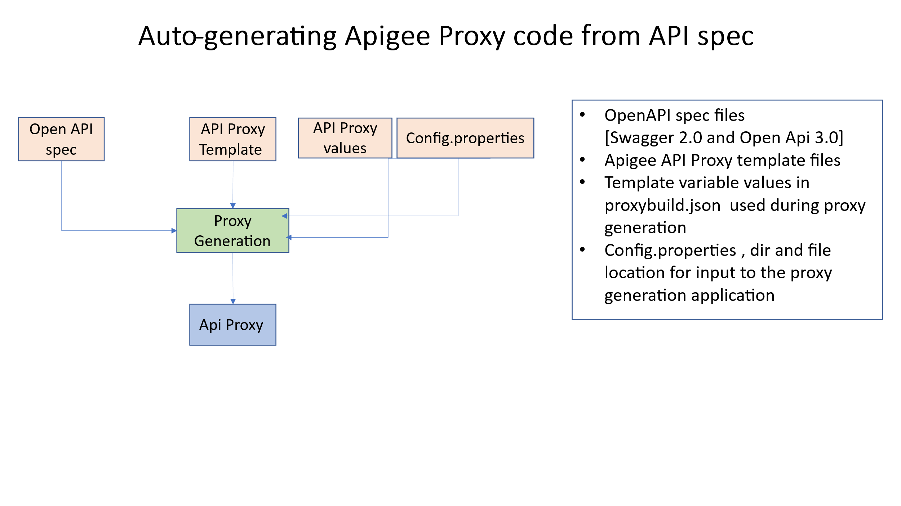

-   [Apigee API Proxy Generation based on
    Templates](#apigee-api-proxy-generation-based-on-templates)

-   [Project Structure](#project-structure)

-   [Execution](#execution)

-   [To install](#to-install)

    -   [Prerequisite & Versions](#prerequisite--versions)

    -   [WSL (Windows Subsystem on Linux)](#wsl-windows-subsystem-on-linux)

    -   [Windows version](#windows-version)

-   [Paths](#paths)

-   [Input files](#input-files)

    -   [Proxytobuild.json](#proxytobuildjson)

    -   [Template Files](#template-files)

    -   [specs folder](#specs-folder)

-   [To run in Windows](#to-run-in-windows)

-   [To run in WSL](#to-run-in-wsl)

-   [To deploy and test generated
    proxies](#to-deploy-and-test-generated-proxies)(#to-deploy-and-test-generated-proxies)

In the general case, API Proxies code deployed on the API Platform support the
non-functional requirements of APIs. These include security , routing,
logging,auditing etc . The API proxy code is repetitive and pattern-based,
making it ideal for templating.

This tool generates proxy code using the following inputs:  
(1) an OpenAPI specification,  
(2) a proxy template, and  
(3) an input JSON message containing values for template variable substitution
and other metadata such as the proxy name.

1.  config.propeties which specifies the location of the file and directories
    for above

### To install

Clone repo to your desktop

<https://github.com/mhashir69/oas-apiproxy-gen/tree/main>

You will always run commands from the \\oas-apiproxy-gen\\src\\specToProxy
folder.

1.  node main.js

2.  Input files , openApi spec, templates in template folder and value to use to
    build proxy (more detailed explanation further down in the document)

    1.  oas-apiproxy-gen\\src\\**specs**\\petstore.yaml

    2.  oas-apiproxy-gen\\src\\specToProxy\\**config.properties**

    3.  oas-apiproxy-gen\\src\\specToProxy\\**templates**\\Template-V3-fh-sec-rt-eh-lg

    4.  oas-apiproxy-gen\\src\\specToProxy\\resources\\**proxytobuild.json**

### Prerequisite & Versions

This code is tested on

1.  Windows 11

2.  Windows Subsystem for Linux.

#### WSL(Windows Subsystem on Linux)

\$ **lsb_release -a**

>   No LSB modules are available.

>   Distributor ID: Ubuntu

>   Description: Ubuntu 22.04.5 LTS

>   Release: 22.04

>   Codename: jammy

\$ **node –version**

>   v20.20.2

npm list \@apidevtools/swagger-parser handlebars lodash fs-extra
properties-reader --depth=0

├── \@apidevtools/swagger-parser\@12.1.0

├── fs-extra\@11.3.4

├── handlebars\@4.7.9

├── lodash\@4.18.1

└── <properties-reader@3.0.1>

Use npm install or upgrade to install the tshese version or the latest ones

\$ **jq --version**

>   jq-1.6

>   Note: install jq on WSL

>   sudo apt install jq

#### Windows version

node --version

>   v20.20.2

>   npm list \@apidevtools/swagger-parser handlebars lodash fs-extra
>   properties-reader --depth=0

>   \+-- \@apidevtools/swagger-parser\@12.1.0

>   \+-- fs-extra\@11.3.4

>   \+-- handlebars\@4.7.9

>   \+-- lodash\@4.18.1

>   \+-- <properties-reader@3.0.1>

### Paths

Please note , the latest version of the code retrieve paths from
**config.properties** , the folder structure can be modified as needed.

src

├── gateway -- **contains generated proxy code**

├── sharedflows

├── specs -- **contains openAPI specs**

├── **specToProxy -- application folder structure**

│ ├── hbs

│ ├── node_modules

│ ├── resources -- **contains file proxytobuild.json**

│ ├── templates -- **contains proxy templates**

│ └── utils

### Input files

#### Proxytobuild.json

An Array of json messages, one item in the array for each proxy to build.

See explainer

[{

"proxyname": "Gen-httpbin", **Name of proxy to build and is written to the
Gateway folder show in the structure above**

"templatename": "Template-V3-fh-sec-rt-eh-lg", **Template to use and is read
from the templates folder**

"basepath": "gen-httpbin",

"urltarget": "https://httpbin.org", **variable urltarget in the template files
will be replaced with this value**

"openapispecfile": "httpbin.yaml" **openApi spec file is read from the specs
folder**

}]

#### Template Files

This should be familiar to you , this is the same folder structure as for an API
proxy file.

The folder structure the proxy template files are stored in

── templates

│ │ └── Template-V3-fh-sec-rt-eh-lg

│ │ └── apiproxy

│ │ ├── manifests

│ │ ├── policies

│ │ ├── proxies

│ │ └── targets

Looking into the files ,

**\\specToProxy\\templates\\Template-V3-fh-sec-rt-eh\\pom.xml**

>   \<project xmlns="http://maven.apache.org/POM/4.0.0" xmlns:xsi="http://www.w3.org/2001/XMLSchema-instance" xsi:schemaLocation="http://maven.apache.org/POM/4.0.0
>   http://maven.apache.org/xsd/maven-4.0.0.xsd"\>

>   \<parent\>\<artifactId\>parent-pom\</artifactId\>

>   \<groupId\>apigee\</groupId\>

>   \<version\>1.0\</version\>

>   \<relativePath\>../shared-pom.xml\</relativePath\>

>   \</parent\>

>   \<modelVersion\>4.0.0\</modelVersion\>

>   \<groupId\>apigee\</groupId\>

**\<artifactId\>{{proxyname}}\</artifactId\> variable, also called handlebar
variable which will be replaced with values from Proxytobuild.json file**

>   \<version\>1.0\</version\>

**\<name\>{{proxyname}}\</name\>**

>   \<packaging\>pom\</packaging\>

>   \</project\>

**Another file**

**\\apiproxy\\proxies\\default.xml**

OK , here we see some more of this handlebar templating code – its minimal

There is the basic variable substitution , and then there is an if condition
check , and a “for loop” to handle multiple paths(routes) . Yes, you have to
learn a few handlebar commands to build your template.

https://handlebarsjs.com/

>   \<ProxyEndpoint name="default"\>

>   \<DefaultFaultRule name="default-fault"\>

>   \<Step\>

>   \<Name\>FC_ErrorHandling\</Name\>

>   \</Step\>

>   \<Step\>

>   \<Name\>FC_Logging\</Name\>

>   \</Step\>

>   \<AlwaysEnforce\>true\</AlwaysEnforce\>

>   \</DefaultFaultRule\>

>   \<PreFlow name="PreFlow"\>

>   \<Request/\>

>   \<Response/\>

>   \</PreFlow\>

\<Flows\>

**{{\#if paths}} {{\#each paths}} // for each uri path**

**\<Flow name="{{keyHttpverb}} {{keyPath}}"\>**

**\<Description\>{{description}}\</Description\>**

**\<Request/\>**

**\<Response/\>**

**\<Condition\>(proxy.pathsuffix MatchesPath "{{keyPath}}") and (request.verb =
"{{loud keyHttpverb}}" )\</Condition\>**

**\</Flow\>**

**{{/each}} {{/if}} // for each uri path**

\</Flows\>

>   \<PostFlow name="PostFlow"\>

>   \<Request/\>

>   \<Response/\>

>   \</PostFlow\>

>   \<HTTPProxyConnection\>

>   \<BasePath\>/{{basepath}}\</BasePath\>

>   \<VirtualHost\>secure\</VirtualHost\>

>   \</HTTPProxyConnection\>

>   \<RouteRule name="default"\>

>   \<TargetEndpoint\>default\</TargetEndpoint\>

>   \</RouteRule\>

>   \</ProxyEndpoint\>

#### specs folder

Is just that, Openapi files either swagger 2.0 or swagger 3.x

### To run in Windows

Change to directory **specToProxy**

oas-apiproxy-gen\\src\\spectoproxy\> **node main.js**

>   Using Swagger Parser Version: Latest/ESM

>   Starting Proxy Build Automation...

>   Processing: petStore (Template: Template-V3-fh-sec-rt-eh)

>   Processing directory:
>   C:\\Users\\abcd\\Documents\\apigeeWS\\apigeeWS\\oas-apiproxy-gen\\src\\gateway\\petStore

>   API name: Swagger Petstore - OpenAPI 3.1, Version: 1.0.12

>   Successfully updated 6 files.

>   Successfully completed build for: petStore

>   Processing: Gen-httpbin (Template: Template-V3-fh-sec-rt-eh)

>   Processing directory:
>   C:\\Users\\mhash\\Documents\\apigeeWS\\apigeeWS\\oas-apiproxy-gen\\src\\gateway\\Gen-httpbin

>   API name: httpbin, Version: 1.0-oas3

>   Successfully updated 6 files.

>   Successfully completed build for: Gen-httpbin

>   Entire build process finished successfully.

### To run in WSL

Change to directory **specToProxy**

/specToProxy\$ node main.js

>   Using Swagger Parser Version: Latest/ESM

>   Starting Proxy Build Automation...

>   Processing: petStore (Template: Template-V3-fh-sec-rt-eh)

>   Processing directory:
>   /mnt/c/Users/mhash/Documents/apigeeWS/apigeeWS/oas-apiproxy-gen/src/gateway/petStore

>   API name: Swagger Petstore - OpenAPI 3.1, Version: 1.0.12

>   Successfully updated 6 files.

>   Successfully completed build for: petStore

>   Processing: Gen-httpbin (Template: Template-V3-fh-sec-rt-eh)

>   Processing directory:
>   /mnt/c/Users/mhash/Documents/apigeeWS/apigeeWS/oas-apiproxy-gen/src/gateway/Gen-httpbin

>   API name: httpbin, Version: 1.0-oas3

>   Successfully updated 6 files.

>   Successfully completed build for: Gen-httpbin

>   Entire build process finished successfully.

### To deploy and test generated proxies

Since both these templates use the shared flow SC-FaultRules build and deploy
that first. The manual steps are z

1.  zip up everything under the folder sharedflowbundle , and import the zip
    file to create a sharedflow . You will be prompted for a name – use the name
    SF_Fault rules. You have probably done this many times before, these
    instructions are just in case

>   "apigeeWS\\oas-apiproxy-gen\\src\\sharedflows\\SF_FaultRules\\**sharedflowbundle**"

1.  Do the same for the generated flows, in the samples provided, these are the
    two generated API Proxies – again similar process, zip up the files under
    api proxy , import zip file to create a proxy in the management UI and
    deploy.

>   " \\apigeeWS\\oas-apiproxy-gen\\src\\gateway\\**Gen-httpbin\\apiproxy**"

>   " \\apigeeWS\\oas-apiproxy-gen\\src\\gateway\\**petStore\\apiproxy**"
